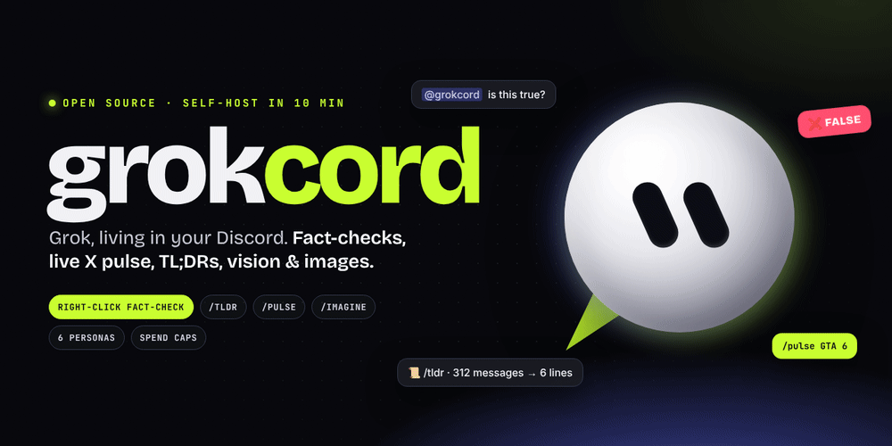

<div align="center">



<br>

&nbsp;&nbsp;<b>×</b>&nbsp;&nbsp;

<b>Grok, living in your Discord.</b><br>
Right-click fact-checks · live X pulse · /tldr for busy channels · vision · images · 6 personas · spend caps

<br>

[](https://github.com/Extradry1111/grokcord/actions/workflows/ci.yml)


[**Quickstart**](#-quickstart-10-minutes) · [**Features**](#-what-it-does) · [**Commands**](#-every-command) · [**Setup guide**](docs/SETUP.md) · [**Promo video**](media/grokcord-promo.mp4)

</div>

<br>

On X, *"@grok is this true?"* became a meme for a reason: people want a fast, sourced answer right where the conversation is.
Discord has nothing like it. Rumours spread, channels hit 300 unread, and nobody knows what the timeline is saying.

**grokcord** puts Grok in your server, with live web and X search built in. Self-host it with your own xAI key: no subscription, no middleman, your data stays between your server and xAI.

<br>

## ⚡ What it does

<table>
<tr>
<td width="50%" valign="top">

### 01 · Right-click → Fact-check
`@grok is this true?`, but in Discord. Right-click **any** message → **Apps → Fact-check with Grok**. Grok searches the web *and* X, then posts a verdict with sources:
**✅ TRUE · 🟢 MOSTLY TRUE · ⚠️ MISLEADING · ❌ FALSE · ❔ UNVERIFIED**

Works on screenshots too. Or reply to a message with `@grokcord is this true?`.

</td>
<td width="50%"></td>
</tr>
<tr>
<td width="50%"></td>
<td width="50%" valign="top">

### 02 · /tldr: what did I miss?
Back from work to 300 unread? `/tldr` reads the last 20–500 messages and gives you **the one-line TL;DR, who said what, and the action items**.

Private by default, so only you see it and the channel isn't spammed.

</td>
</tr>
<tr>
<td width="50%" valign="top">

### 03 · /pulse: the timeline, live
`/pulse topic: <anything>` searches X in real time (last hour → last week) and returns **the mood, the winning take, the main viewpoints with @handles, and what's verified vs rumour**.

Coins, launches, games, drama. Only Grok can do this natively.

</td>
<td width="50%"></td>
</tr>
<tr>
<td width="50%"></td>
<td width="50%" valign="top">

### 04 · 6 personas, one Grok
**helper · analyst · roast · teacher · mod · degen**, or write your own.
Set one for the whole server and override per channel: `#trading` gets the analyst, `#memes` gets roast mode.

</td>
</tr>
</table>

### …and everything a server actually needs

| | |
|---|---|
| 💬 **@mention chat** | Tag it anywhere. It reads the last few messages for context and answers like a member of the chat. |
| ↩️ **Reply to ask** | Reply to any message with `@grokcord explain this` and Grok sees the message you replied to, images included. |
| 🧵 **/chat threads** | Opens a thread where Grok answers **every** message, no @ needed, and remembers the whole thread. |
| 👁️ **Vision** | Attach a screenshot, chart, meme or error message and ask about it. |
| 🎨 **/imagine** | Image generation with Grok Imagine, posted right in the channel. |
| 🌍 **Translate** | Right-click → **Translate with Grok** translates into *your* Discord language automatically. |
| 🧠 **Explain** | Right-click → **Explain with Grok** decodes slang, memes, jargon or code. |
| 💸 **Spend caps** | Daily limits per member **and** per server, so nobody wakes up to a surprise bill. |
| 🎛️ **Feature toggles** | Admins can switch any feature off per server (no images in a kids' server, for example). |
| 🔒 **Safe by default** | The bot can't ping @everyone, needs no admin permissions, and stores **no message content**. |

<br>

## 🚀 Quickstart (10 minutes)

> Full walkthrough with every click: **[docs/SETUP.md](docs/SETUP.md)**

**1. Create a Discord bot** at [discord.com/developers](https://discord.com/developers/applications) → **Bot** → copy the token → turn on **Message Content Intent** → invite it with the [link in the guide](docs/SETUP.md#1-create-the-discord-bot-3-min).

**2. Get an xAI API key** at [console.x.ai](https://console.x.ai).

**3. Run it:**

```bash
git clone https://github.com/Extradry1111/grokcord && cd grokcord
cp .env.example .env            # paste DISCORD_TOKEN and XAI_API_KEY
pip install -r requirements.txt
python -m grokcord
```

Or keep it online 24/7 with Docker:

```bash
docker compose up -d
```

Or deploy to **Railway** in a few clicks: fork → *Deploy from GitHub* → add the two variables. `railway.json` is included.

<br>

## 📖 Every command

| Command | Who | What it does |
|---|---|---|
| `@grokcord <anything>` | everyone | Chat with Grok, with channel context and live search |
| Right-click → **Fact-check with Grok** | everyone | Verdict + sources, posted publicly |
| Right-click → **Explain with Grok** | everyone | Plain-English explanation, only you see it |
| Right-click → **Translate with Grok** | everyone | Into your Discord language, only you see it |
| `/ask question [image] [search] [private]` | everyone | One-off question, optional image, optional live search |
| `/tldr [messages] [private]` | everyone | Summarise the last 20–500 messages |
| `/pulse topic [hours]` | everyone | What X is saying right now, with sources |
| `/imagine prompt` | everyone | Generate an image |
| `/chat topic` | everyone | Open a Grok thread with memory |
| `/usage` | everyone | Your units left today |
| `/help` | everyone | All of the above, in Discord |
| `/grokcord persona` | admins | Pick a built-in persona or write your own, per server or channel |
| `/grokcord reset-persona` | admins | Back to default |
| `/grokcord limits` | admins | Daily caps per member and per server |
| `/grokcord feature` | admins | Turn any feature on or off |
| `/grokcord status` | admins | Model, persona, caps and disabled features at a glance |

*Admins = members with **Manage Server**. Server owners can change who sees admin commands in **Server Settings → Integrations**.*

<br>

## ⚙️ Configuration

All settings live in `.env` ([example](.env.example)):

| Variable | Default | |
|---|---|---|
| `DISCORD_TOKEN` | required | Your bot token |
| `XAI_API_KEY` | required | Your xAI key |
| `GROK_MODEL` | `grok-4.7` | Text, vision and search model |
| `GROK_IMAGE_MODEL` | `grok-imagine-image-2.0` | Image model |
| `DAILY_USER_LIMIT` | `40` | Units per member per day |
| `DAILY_GUILD_LIMIT` | `600` | Units per server per day |
| `IMAGE_COST` | `5` | Units one image costs (a text answer = 1) |
| `DEFAULT_PERSONA` | `helper` | `helper` `analyst` `roast` `teacher` `mod` `degen` |
| `DEV_GUILD_ID` | | Your test server ID, so slash commands show up instantly |
| `DATABASE_PATH` | `grokcord.db` | SQLite file for settings and usage counters |

Caps reset at 00:00 UTC. Admins can override them per server with `/grokcord limits`.

<br>

## 💸 What it costs

grokcord is free. You pay xAI directly for what your server uses, at [xAI's API prices](https://x.ai/api). Fact-checks, `/pulse` and @mention chat use live search, which costs more per answer than plain chat. Images are billed per image.

To keep it predictable:
1. Set a **monthly limit** in the [xAI console](https://console.x.ai).
2. Keep grokcord's **daily caps** (on by default) and tune them with `/grokcord limits`.
3. Turn off what you don't need with `/grokcord feature`.

<br>

## 🔒 Privacy & safety

- **Nothing is stored except settings and usage counts.** No message content is saved to disk.
- Messages go to xAI **only when someone uses grokcord**: an @mention, a right-click, or a command. `/tldr` reads history only when asked.
- The bot **can't ping** @everyone, @here, roles or users in its answers.
- It needs **no admin permissions**: just read, send, embed, attach, and create threads.
- Fact-checks are AI output. They cite sources so people can check, and they say **UNVERIFIED** rather than guess.

<br>

## 🧩 How it works

```
Discord ──▶ grokcord (discord.py) ──▶ xAI Responses API ──▶ grok-4.7
   ▲             │                         └─ web_search · x_search tools
   │             ├─ SQLite: personas · caps · usage
   └─────────────┘   embeds · verdicts · sources
```

~1,000 lines of readable Python in [`grokcord/`](grokcord). Fork it and make it yours:

| File | |
|---|---|
| [`bot.py`](grokcord/bot.py) | Discord commands, right-click apps, @mention chat, caps |
| [`grok.py`](grokcord/grok.py) | xAI calls: chat, fact-check, pulse, tldr, images, source extraction |
| [`prompts.py`](grokcord/prompts.py) | Every prompt and persona. **Edit this to change Grok's voice.** |
| [`store.py`](grokcord/store.py) | SQLite settings and usage |
| [`formatting.py`](grokcord/formatting.py) | Embeds, verdict colours, message splitting |

```bash
pip install -r requirements.txt pytest pytest-asyncio
python -m pytest        # 21 tests, no API keys needed
```

<br>

## ❓ FAQ

<details><summary><b>Is this the official Grok bot?</b></summary>
No. grokcord is an independent open-source project that uses the public xAI API. It isn't affiliated with or endorsed by xAI or Discord.
</details>

<details><summary><b>Do my members need an X or Grok account?</b></summary>
No. Only the person hosting the bot needs an xAI API key.
</details>

<details><summary><b>Can I use it in many servers at once?</b></summary>
Yes. Invite the same bot anywhere. Personas, caps and toggles are stored per server.
</details>

<details><summary><b>A new Grok model came out. How do I switch?</b></summary>
Change <code>GROK_MODEL</code> in <code>.env</code> and restart. No code changes.
</details>

<details><summary><b>Why does it need Message Content Intent?</b></summary>
To read @mentions, replies and channel history for <code>/tldr</code>. Without it Discord hides message text from bots.
</details>

<details><summary><b>The demo GIFs: are those real answers?</b></summary>
They're animated mockups that show the layout and flow. Real answers depend on what Grok finds when you run it.
</details>

<br>

## 🤝 Contributing

PRs welcome. Good first ideas: new personas in [`prompts.py`](grokcord/prompts.py), a `/poll` summariser, a daily "server digest" post, Telegram support.
The demo visuals are code too: [`studio/`](studio) renders every GIF and the promo video from HTML (`npm i` then `./make.sh` / `./promo.sh`).

<br>

<div align="center">
&nbsp;&nbsp;&nbsp;

**grokcord** · MIT · built by [@Pashoke1](https://x.com/Pashoke1)

If it saved your server from one rumour, ⭐ star it.

<sub>Not affiliated with xAI or Discord. Grok is a trademark of xAI; Discord is a trademark of Discord Inc.</sub>
</div>
